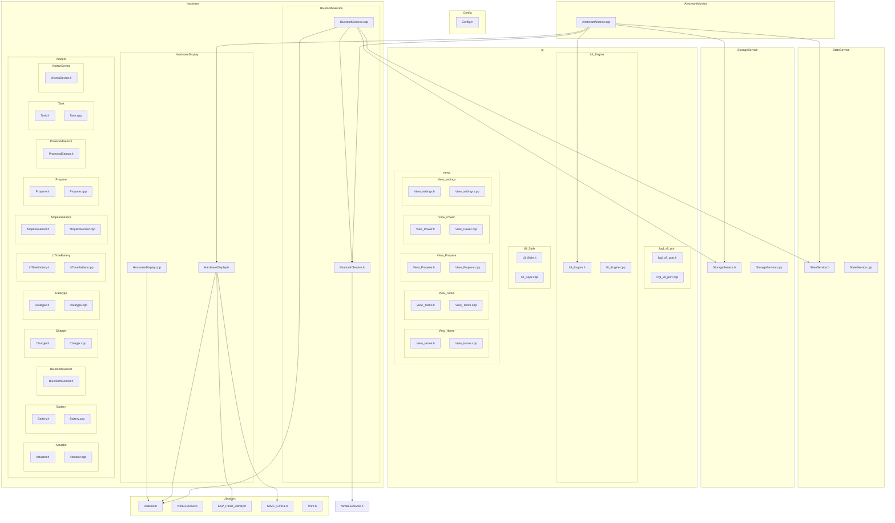

```mermaid

graph TD
    subgraph AirstreamMonitor
        AirstreamMonitor.cpp
    end
    subgraph Config
        Config.h
    end
    subgraph StateService
        StateService.h
        StateService.cpp
    end
    subgraph StorageService
        StorageService.h
        StorageService.cpp
    end
    subgraph ui
        subgraph lvgl_v8_port
            lvgl_v8_port.h
            lvgl_v8_port.cpp
        end
        subgraph UI_Engine
            UI_Engine.h
            UI_Engine.cpp
        end
        subgraph UI_Style
            UI_Style.h
            UI_Style.cpp
        end
        subgraph views
            subgraph View_Home
                View_Home.h
                View_Home.cpp
            end
            subgraph View_Tanks
                View_Tanks.h
                View_Tanks.cpp
            end
            subgraph View_Propane
                View_Propane.h
                View_Propane.cpp
            end
            subgraph View_Power
                View_Power.h
                View_Power.cpp
            end
            subgraph View_settings
                View_settings.h
                View_settings.cpp
            end    
        end
    end
    subgraph hardware
        subgraph BluetoothService
            BluetoothService.h
            BluetoothService.cpp
        end
        subgraph HardwareDisplay
            HardwareDisplay.h
            HardwareDisplay.cpp
        end
        subgraph models
            subgraph Actuator
                Actuator.h
                Actuator.cpp
            end
            subgraph Battery
                Battery.h
                Battery.cpp
            end
            subgraph BluetoothSensor
                BluetoothSensor.h
            end
            subgraph Charger
                Charger.h
                Charger.cpp
            end
            subgraph Datatype
                Datatype.h
                Datatype.cpp
            end
            subgraph LiTimeBattery
                LiTimeBattery.h
                LiTimeBattery.cpp
            end
            subgraph MopekaSensor
                MopekaSensor.h
                MopekaSensor.cpp
            end
            subgraph Propane
                Propane.h
                Propane.cpp
            end
            subgraph ProtectedSensor
                ProtectedSensor.h
            end
            subgraph Tank
                Tank.h
                Tank.cpp
            end
            subgraph VictronDevice
                VictronDevice.h
            end
        end
    end

    subgraph Librairies
        Arduino.h
        NimBLEDevice
        ESP_Panel_Library.h
        TAMC_GT911.h
        Wire.h
    end


    %% Flux des Dépendances (Flèches = Qui inclut Qui)
    AirstreamMonitor.cpp --> UI_Engine.h
    AirstreamMonitor.cpp --> BluetoothService.h
    AirstreamMonitor.cpp --> HardwareDisplay.h
    AirstreamMonitor.cpp --> StateService.h
    AirstreamMonitor.cpp --> StorageService.h

    BluetoothService.h   --> NimBLEDevice.h
    BluetoothService.cpp --> Arduino.h
    BluetoothService.cpp --> BluetoothService.h
    BluetoothService.cpp --> StateService.h
    BluetoothService.cpp --> StorageService.h

    HardwareDisplay.h    --> Arduino.h
    HardwareDisplay.h    --> ESP_Panel_Library.h
    HardwareDisplay.h    --> TAMC_GT911.h
    HardwareDisplay.cpp  --> Arduino.h

```